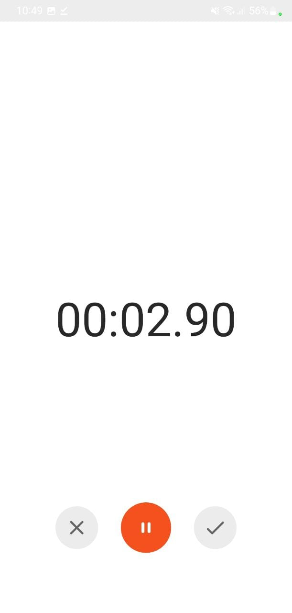
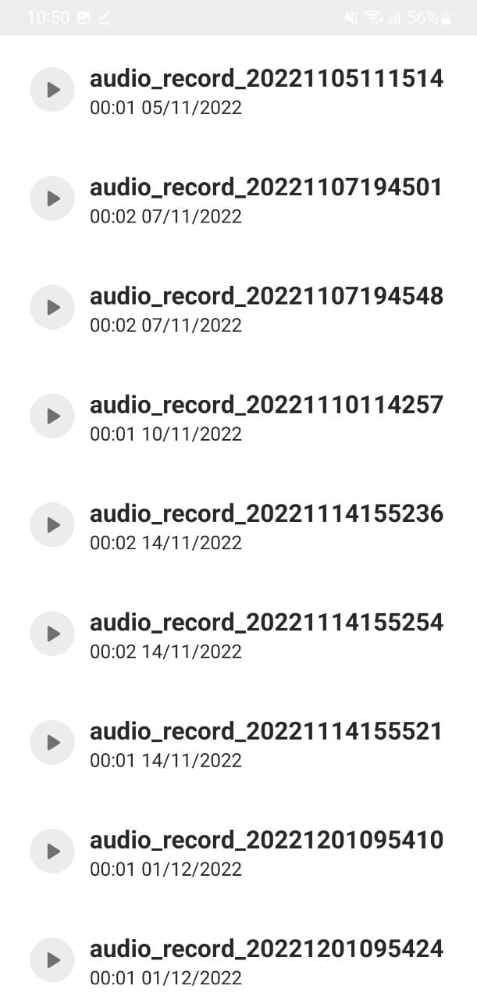

# Record App to transcribe

Install Android Studio to use the App

<h2>About</h2>

This app came from the goal of getting people involved in AI safety to record their rough everyday conversations, so that eventually we can train a LLM, and get it to produce AI safety research ideas. We are optimizing mostly for low friction so that these busy people actually use it.

<h2>Features</h2>

The android app lets you:
- Record audio and storing it
- View the recording list

<h2>To Do</h2>

1. Be able to play back the recorded audios
1. Editor: cut out parts
1. Share them via email or social media
1. Automatic sharing to a set email address
1. Saying "stop recording please" stops the recording

<h2>Screenshots</h2>

    

<h2>Contributing</h2>

Feel free to fork this and rewrite all you need to! Other potential projects that could contribute are:
 - An iPhone app
 - A discord bot like [Craig](https://craig.chat/) that's a little more streamlined in that after it finishes recording it automatically sends the file without more need from the user
 - Something similar for zoom + meet + teams
